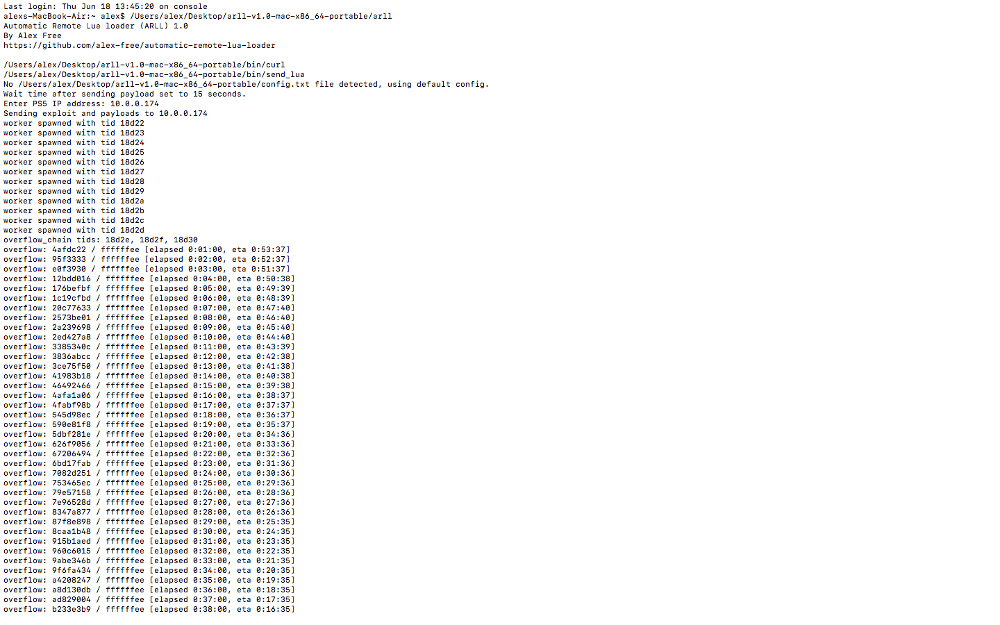
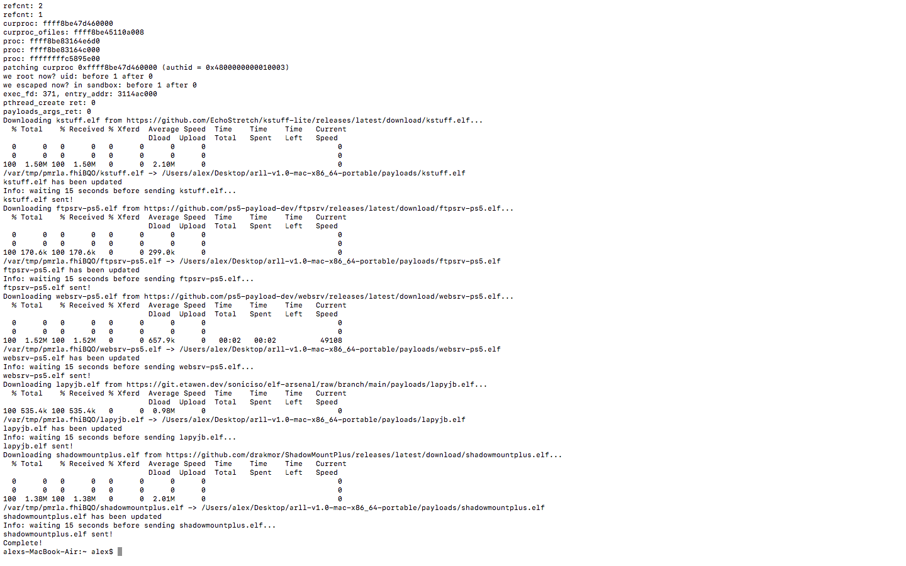

# Automatic Remote Lua Loader

_By Alex Free_.

Send the remote lua loader exploit and the latest payloads of your choosing in one command from your computer. This is NOT a tradditonal PS5 auto loader where it happens all on the console. This is used entirely on PC, hence **AUTOMATIC REMOTE** Lua Loader. You should already have a save game exploit for remote lua laoder and a compatible game before continuing. See my [guide](https://alex-free.github.io/ps5-jb-12.70fw-tutorial/) for setting that up.

* Saves your PS5 IP address to a config file for the future so you only need to enter it once.

* Sends P2JB exploit via remote lua loader automatically.

* Downloads and sends the latest version of payloads you specify in the config file (default config file is made if one doesn't already exist).

* Keeps downloaded payloads for future use.

* Portable self-contained release for Mac and Linux.

* Linux .deb and .rpm package files available. 





By default, these are the payloads sent by Automatic Remote Lua Loader (after it sends [remote_lua_loader](https://github.com/n0llptr/remote_lua_loader) by [N0llptr](https://github.com/n0llptr/remote_lua_loader)):

* [Kstuff](https://github.com/EchoStretch/kstuff-lite) by [EchoStretch](https://github.com/EchoStretch).

* [WebSrv](https://github.com/ps5-payload-dev/websrv) by [PS5-Payload-Dev](https://github.com/ps5-payload-dev).

* [FTPSrv](https://github.com/ps5-payload-dev/ftpsrv) by [PS5-Payload-Dev](https://github.com/ps5-payload-dev).

* [LapyJB](https://git.etawen.dev/soniciso/elf-arsenal/raw/branch/main/payloads/lapyjb.elf) by [SonicISO](https://git.etawen.dev/soniciso)

* [ShadowMountPlus](https://github.com/drakmor/ShadowMountPlus) by [Drakmor](https://github.com/drakmor).

The latest are downloaded by default, and saved for later use. You can specify to download the latest at any time as well, see the [config file](#config-file) section for more info. You can also change, add, or remove any of them.


| [Homepage](https://alex-free.github.io/automatic-remote-lua-loader) | [Github](https://github.com/alex-free/automatic-remote-lua-loader) |

## Table Of Contents

* [Downloads](#downloads)
* [Usage](#usage)
* [Config File](#config-file)
* [Payloads](#payloads)
* [Notes](#notes)
* [License](license.md)
* [Building](build.md)

## Downloads

The portable releases include all the dependencies required to run Automatic Remote Lua Loader in a self-contained folder you extract, and is ready to run on Mac OS and Linux. The `.deb` and `.rpm` Linux package files will use your Linux package manager to install the dependencies and makes the `arll` command available system-wide.

### Version 1.0 (6/18/2026)

Changes:

* Initial release.

----------------------------------------------------

* [arll-v1.0-mac-x86\_64-portable.zip](https://github.com/alex-free/automatic-remote-lua-loader/releases/download/v1.0/arll-v1.0-mac-x86_64-portable.zip) _Portable Release For Mac OS 10.12_

* [arll-v1.0-linux-x86\_64-portable.zip](https://github.com/alex-free/automatic-remote-lua-loader/releases/download/v1.0/arll-v1.0-linux-x86_64-portable.zip) _Portable Release For x86\_64 Linux (64 bit)_

* [arll-v1.0.deb](https://github.com/alex-free/automatic-remote-lua-loader/releases/download/v1.0/arll-v1.0.deb) _Deb package file for x86\_64 Linux (64 bit)_

* [arll-v1.0-1.noarch.rpm](https://github.com/alex-free/automatic-remote-lua-loader/releases/download/v1.0/arll-v1.0-1.noarch.rpm) _RPM package file for x86\_64 Linux (64 bit)_

---------------------------------------

## Usage

1) Set up save game exploit (see [guide](https://alex-free.github.io/ps5-jb-12.70fw-tutorial/)).
2) Launch the lua game.
3) Run `arll`.

```
Usage:
        arll       Jailbreak, download latest payloads only if they don't exist, send payloads.

        arll -u       Jailbreak, update all payloads to latest, send latest payloads.

        arll -r       Reset. Delete saved config and downloaded payloads.

```

## Config File

The default config file is:

```
# Seconds to wait after sending the payload.
delay=15

# Kernel stuff. MUST BE RAN BEFORE ANY OTHER PAYLOAD IS SENT.
https://github.com/EchoStretch/kstuff-lite/releases/latest/download/kstuff.elf
#https://github.com/drakmor/kstuff-lite/releases/latest/download/kstuff.elf

# FTP server for network transfers.
https://github.com/ps5-payload-dev/ftpsrv/releases/latest/download/ftpsrv-ps5.elf

# Web server for homebrew apps and stuff.
https://github.com/ps5-payload-dev/websrv/releases/latest/download/websrv-ps5.elf

# ETAHen functionality for i.e. PS5 Explorer.
https://git.etawen.dev/soniciso/elf-arsenal/raw/branch/main/payloads/lapyjb.elf

# Backup/Homebrew mounter.
https://github.com/drakmor/ShadowMountPlus/releases/latest/download/shadowmountplus.elf
```
If you are using the portable release, this will be found at `config.txt` inside the allr extracted release. If you are using the .deb or .rpm package release this will be at `~/.config/automatic-remote-lua-loader/config.txt`.

Editing rules:

* The `delay=15` value specifies how long allr waits (in seconds) before sending a payload, and must be present. It can be changed but not removed.

* Kstuff must be the first payload sent, keep it at the top of the config file.

* One elf file url per line.

* Anything line starting with `#` will be ignored as a comment.

* Any blank line will be ignored.

You can reset the config to defaults, and delete any downloaded payloads be executing allr with the `-r` argument (`allr -r`).

## Payloads

If you are using the portable release, this will be found at `payloads` inside the allr extracted release. If you are using the .deb or .rpm package release this will be at `~/.config/automatic-remote-lua-loader/payloads`.

If you put an elf file url in the config.txt file and it has not yet been downloaded into the `payloads` folder, allr will do so. By default, allr checks if a payload has been downloaded, and if so it will not download it again. If you need to update the payload, execute allr with the -u argument (`allr -u`).

## Notes

* P2JB exploit can fail or get stuck (and your PS5 may KP or lua game may crash back to the home screen). If arll gets stuck sending PS2JB, `ctrl+c` out of it. Then shutdown your PS5 (not restart) and turn it back on for the best chances of success.

* Currently default is EchoStreth Kstuff. Drakmor Kstuff is available in the default config but commented out. Comment out EchoStretch Kstuff and uncomment Drakmor Kstuff if you want to switch.

* The 'delay' functionallity is to not spam elfdr with payloads and give each time to 'breathe' and startup. Feel free to expierement with other values, but the 15 seconds default seems like a solid balance.
